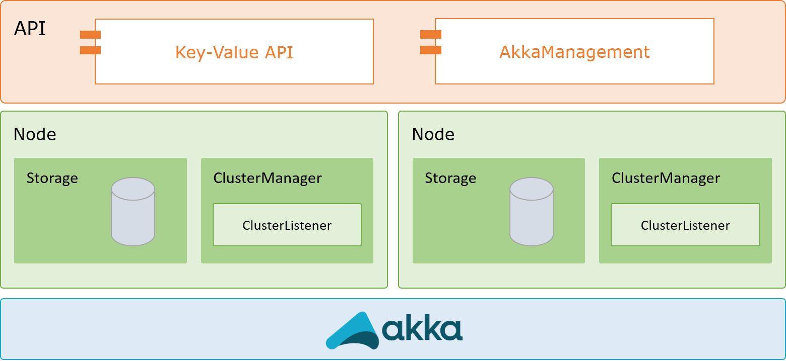

# Distributed key-value store with Akka

The goal of this project is to provide a distributed key-value store using [Akka](https://akka.io/). The store stores each data element into R replicas to tolerate up to R-1 simultaneous failures without losing any information. Upon the failure of a node, the data it stored is replicated to a new node to ensure that the system has again R copies.

## Architecture

The architecure proposed is based in layers. The first layer is the API layer which provides an easy way to interact with the cluster, which is on top of Akka as it is shown below.

## API

### AkkaManagement

The Akka Management API provides several routes in order to test the state of the cluster and its members.

| Path | HTTP method | Required form fields |
| ---- | ----------- | -------------------- |
| `cluster/members` | GET | Returns the status of the Cluster in JSON format. |
| `cluster/members/:address` | GET | Returns the status of `:address` in the Cluster in JSON format. |
| `cluster/shards/:name` | GET | Returns shard info for the shard region with the provided `:name`. |

